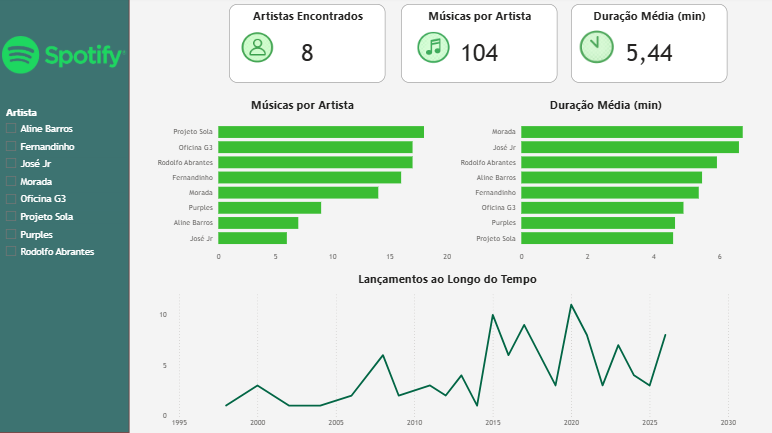

# Spotify Music Analytics — Gospel BR

Projeto de análise de dados desenvolvido com Python e Power BI para mapear o comportamento musical de artistas do segmento gospel brasileiro na plataforma Spotify.

## Dashboard Preview

## Contexto

O mercado de música gospel brasileiro movimenta bilhões de reais anualmente e possui uma base de consumidores extremamente fiel. Este projeto utiliza dados públicos da Spotify Web API para extrair métricas de artistas relevantes do segmento, com o objetivo de identificar padrões de produção musical, duração de faixas e volume de catálogo por artista.

## Insights da Análise

- **Projeto Sola e Oficina G3** lideram em volume de faixas catalogadas, com mais de 15 músicas cada no dataset
- **Morada e José Jr** possuem as músicas mais longas em média, superando 6 minutos — reflexo do estilo de adoração prolongada
- **Projeto Sola** tem a música mais curta do dataset, com menos de 3 minutos, mostrando versatilidade no catálogo
- A produção musical gospel cresceu significativamente a partir de **2015**, com pico de lançamentos entre 2020 e 2024
- **Nenhum artista** possui músicas com conteúdo explícito — 100% do catálogo é família-friendly, como esperado no segmento gospel
- ## Objetivos

- Coletar dados de músicas e álbuns de 8 artistas do gospel brasileiro via API REST
- Realizar limpeza e tratamento dos dados com Python e Pandas
- Responder perguntas de negócio através de visualizações no Power BI

## Perguntas de Negócio

1. Qual artista possui maior volume de faixas catalogadas no Spotify?
2. Qual é a duração média das músicas por artista — e o que isso diz sobre o estilo de cada um?
3. Como a produção musical evoluiu ao longo dos anos por artista?
4. Existe correlação entre duração das faixas e ano de lançamento?

## Stack Tecnológica

| Camada | Tecnologia |
|--------|------------|
| Coleta de dados | Python, Spotipy, Spotify Web API |
| Transformação | Python, Pandas |
| Visualização | Power BI |
| Versionamento | Git, GitHub |
## Dataset

104 faixas coletadas de 8 artistas, com os seguintes atributos:

| Coluna | Tipo | Descrição |
|--------|------|-----------|
| artista_buscado | string | Artista pesquisado |
| musica | string | Nome da faixa |
| album | string | Nome do álbum |
| data_lancamento | date | Data de lançamento |
| duracao_min | float | Duração em minutos |
| ano_lancamento | int | Ano extraído da data |
| explicit | string | Conteúdo explícito (Sim/Não) |

## Artistas Analisados

Projeto Sola · Morada · Fernandinho · Oficina G3 · Rodolfo Abrantes · Aline Barros · José Jr · Purples

## Limitações

Devido às restrições da API do Spotify em modo de desenvolvimento (fevereiro/2026), o dataset é limitado a 20 músicas por artista. Os dados representam uma amostra do catálogo de cada artista.

## Próximos Passos

- Expandir o dataset com mais artistas do segmento
- Incluir dados de seguidores via autenticação OAuth2
- Automatizar a atualização do dataset com agendamento
